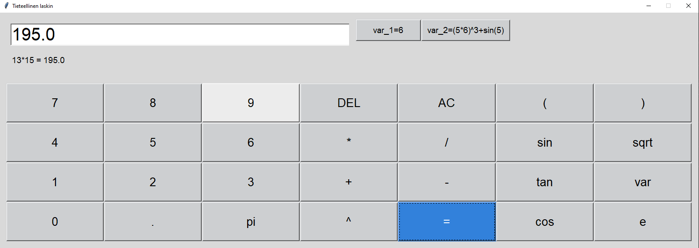

# Käyttöohje

### Yleistä laskimen käytöstä
Ohjelma mallintaa fyysistä laskinta. Lausekkeen voi syöttää ainoastaan laskimessa olevien painikkeiden kautta (ei näppäimistöltä).  
### Omien muuttujien luonti
Oman muuttujan luominen aloitetaan klikkaamalla `var`-painiketta ja syöttämällä tämän jälkeen laskimeen muuttujan arvo. Muuttuja tallentuu klikkaamalla `=`-painiketta. Luodut muuttujat tulevat näkyviin uusina painikkeina laskimen oikeaan yläreunaan. Muuttujien nimet ovat muotoa `var_<monesko muuttuja>=<muuttujan arvo>`. Kun luodulle muuttujalle syntynyttä painiketta klikataan, tulostuu syötekenttään muuttujan arvo.
### Käyttöliittymä
Esimerkkinäkymä:
  