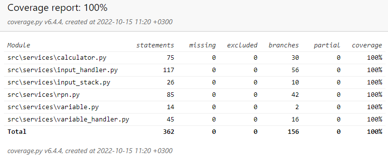

### Testausdokumentti
Testit suoritetaan *pytest*-kirjastolla.
### Rpn-luokka
`Rpn`-luokalle on tehty kattavat yksikkötestit. `Shunting_yard` -algoritmin toimintaa testataan usealla erilaisella syötteellä, jolloin sen tulee palauttaa joko oikeanlainen merkkijono, tai virhetilanteessa `None`. Lisäksi testataan merkkijonon listaksi muuntavaa metodia `str_input_to_list`.
### Testikattavuus
